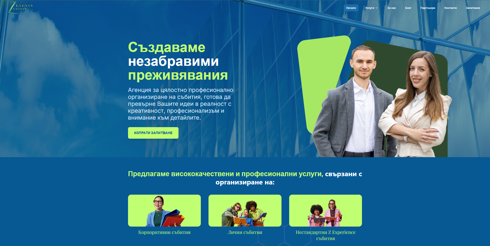
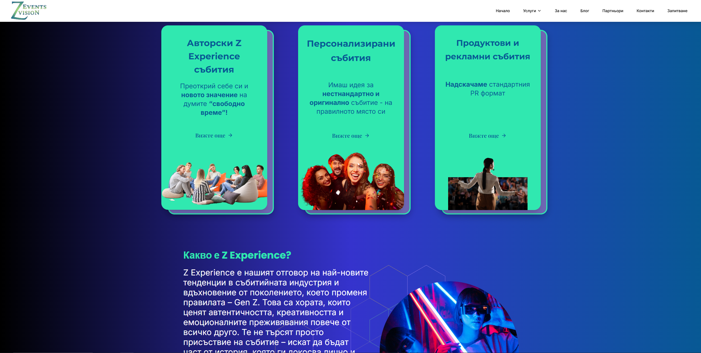
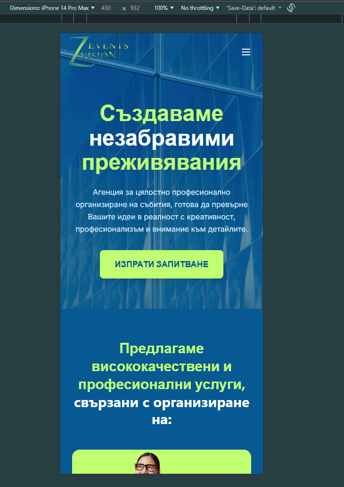
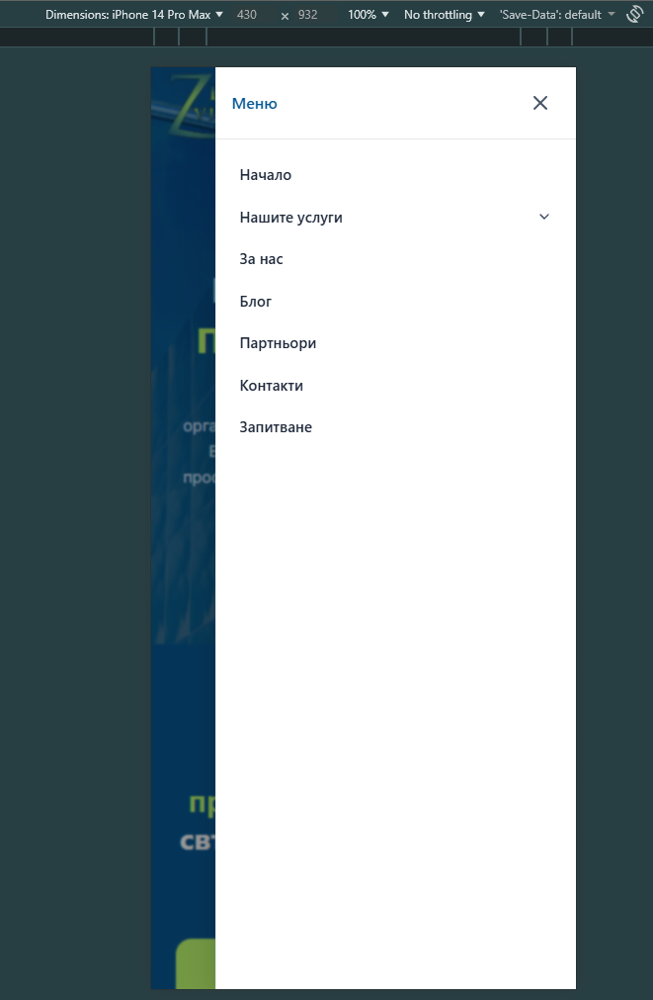

# Events Z Vision – Website

Production website built for Events Z Vision.

## 🌍 Live
https://eventszvision.bg/

## 📸 Screenshots

## ⚛️ Tech Stack
- React
- TypeScript
- Tailwind CSS
- React Router
- Vite
- - Responsive design (mobile-first)

## 👤 My Role
- Built the UI using React and TypeScript
- Implemented full responsive layout (mobile, tablet, desktop)
- Structured components and styling
- Worked on real production requirements

## 🤝 Collaboration
Developed together with a collaborator who handled some JavaScript logic, while I focused on TypeScript and responsive UI.

## ✨ Features
- Fully responsive design
- Clean and modern UI
- Production-ready layout
- Real client website

## 📌 Status
Live and actively used.

## Why this project matters
This project was built to meet real client needs and is actively used in production.
